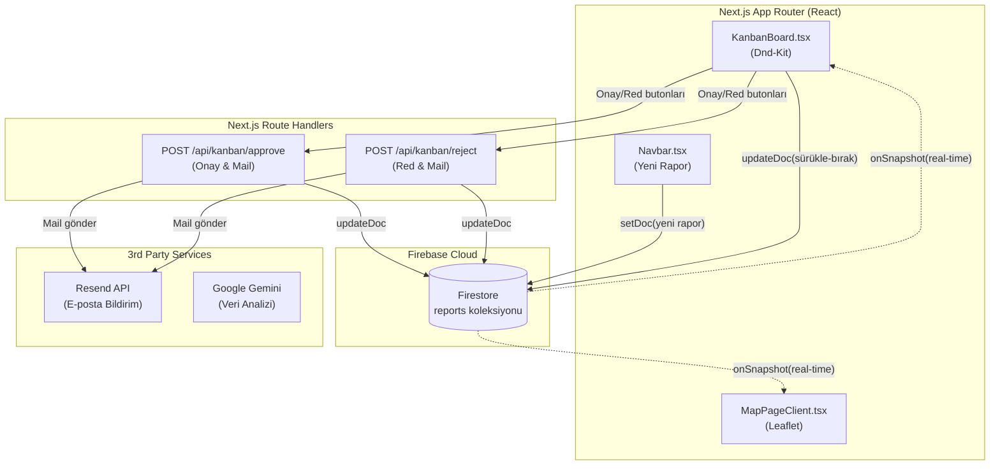

<h1 align="center">💧 AquaGuard — Gerçek Zamanlı Su Kalitesi İzleme Sistemi</h1>

<p align="center">
  <strong>Türkiye genelindeki su kaynaklarının kalitesini izlemek, raporlamak ve yapay zeka (Gemini) ile analiz etmek için geliştirilmiş; Firebase destekli, gerçek zamanlı (real-time) raporlama ve harita entegrasyonu sunan modern bir web platformu.</strong>
</p>

<p align="center">
  <a href="#"></a>
  
  
  
  <a href="LICENSE"></a>
</p>

<p align="center">
  <a href="#nasil-calisir"><strong>Nasıl Çalışır</strong></a> ·
  <a href="#hizli-baslangic">Hızlı Başlangıç</a> ·
  <a href="#yapilandirma">Yapılandırma</a> ·
  <a href="#mimari">Mimari</a>
</p>

> v3 sürümü ile birlikte AquaGuard, in-memory ve localStorage bağımlılığından tamamen kurtulmuş ve gücünü Firebase Firestore'dan alan gerçek zamanlı (real-time) bir mimariye geçiş yapmıştır.

---

## İçindekiler

- [Neden Var](#neden-var)
- [Özellikler (v3 Güncellemeleri)](#ozellikler)
- [Nasıl Çalışır](#nasil-calisir)
- [Mimari](#mimari)
- [Hızlı Başlangıç](#hizli-baslangic)
- [Yapılandırma](#yapilandirma)
- [İş Akışı](#is-akisi)

---

## Neden Var

Çevre kirliliği ve su kalitesi verileri genellikle dağınık, takibi zor ve statik raporlar halinde sunulmaktadır. İhbarların yetkililere ulaşması, incelenmesi ve halka açık haritalarda yayınlanması uzun bürokratik süreçler gerektirebilir. 

AquaGuard, bu süreci **gerçek zamanlı bir Kanban panosu** ve **canlı harita** ile dijitalleştirir. Bir vatandaş kirlilik ihbarında bulunduğunda bu veri anında sisteme düşer, yapay zeka tarafından analiz edilir ve uzman/yönetici onay mekanizmalarından geçerek saniyeler içinde haritada yerini alır.

---

## Özellikler (v3 Güncellemeleri)

| | |
|---|---|
| ⚡ **Gerçek Zamanlı Kanban** | Raporlar yetkililer arasında sürükle-bırak yöntemiyle taşınırken veritabanı anında güncellenir. Başka bir yetkili kartı taşıdığında ekranınız sayfayı yenilemeye gerek kalmadan senkronize olur. |
| 🗺️ **Canlı Harita** | Pano (Dashboard) ve interaktif harita sayfası doğrudan Firestore veritabanını dinler. Eklenen her yeni rapor anında haritada kırmızı/sarı/yeşil bir nokta olarak belirir. |
| ☁️ **Firebase Firestore** | Önceki sürümlerdeki LocalStorage sınırlandırmaları kaldırılarak güvenli ve ölçeklenebilir bulut veritabanı altyapısına geçilmiştir. |
| 🤖 **AI Analiz** | Gemini yapay zekası, kirlilik ihbarlarını okuyarak risk seviyesi tahmini ve çözüm önerileri üretir. |
| 📧 **Otomatik E-posta Bildirimleri** | Onaylanan veya reddedilen raporlar sonrasında ilgili kişilere otomatik bildirim postaları (Resend API) gönderilir. |
| 📊 **İnteraktif Dashboard** | Türkiye genelindeki su durumunu Recharts tabanlı dinamik grafikler ve istatistiklerle özetler. |

---

## Nasıl Çalışır

1. **Raporlama (Ingestion)** — Vatandaş veya uzmanlar tarafından konum (Örn: "Ergene Nehri"), başlık ve kirlilik durumu belirtilerek yeni bir rapor oluşturulur.
2. **Geocoding & Kayıt** — Konum bilgisi koordinatlara çevrilir, risk seviyesine göre renk atanır ve Firestore'a kaydedilir.
3. **Gerçek Zamanlı Yansıma** — Firestore `onSnapshot` dinleyicileri sayesinde bu rapor, anında Dashboard, Harita ve Kanban panosunda belirir.
4. **Onay Mekanizması** — Uzmanlar Kanban üzerinden raporu `1. Onay`'a, Yöneticiler ise `Yayınlandı` kolonuna sürükler.
5. **Bilgilendirme** — Rapor reddedildiğinde veya onaylandığında rapor sahibine (veya adminlere) e-posta ile bildirim gider.

---

## Mimari



---

## Hızlı Başlangıç

Projeyi yerel ortamınızda çalıştırmak için:

1. Repoyu bilgisayarınıza klonlayın.
2. Bağımlılıkları yükleyin:
   ```bash
   npm install
   ```
3. Firebase ve Resend yapılandırmanızı içeren `.env.local` dosyasını oluşturun (Bkz: [Yapılandırma](#yapilandirma)).
4. Geliştirme sunucusunu başlatın:
   ```bash
   npm run dev
   ```
5. Tarayıcınızda `http://localhost:3000` adresine gidin.

---

## Yapılandırma

Projenin kök dizininde bir `.env.local` dosyası oluşturun ve aşağıdaki değişkenleri kendi projenize göre doldurun:

```env
# Firebase Yapılandırması
NEXT_PUBLIC_FIREBASE_API_KEY="api_key_buraya"
NEXT_PUBLIC_FIREBASE_AUTH_DOMAIN="proje_id.firebaseapp.com"
NEXT_PUBLIC_FIREBASE_PROJECT_ID="proje_id"
NEXT_PUBLIC_FIREBASE_STORAGE_BUCKET="proje_id.firebasestorage.app"
NEXT_PUBLIC_FIREBASE_MESSAGING_SENDER_ID="sender_id"
NEXT_PUBLIC_FIREBASE_APP_ID="app_id"

# Bildirim (Resend) API Anahtarı
RESEND_API_KEY="re_..."

# Yönetici E-posta Adresleri
ADMIN_EMAIL="admin@aquaguard.com"
YONETICI_EMAIL="yonetici@aquaguard.com"
```

---
*Geliştirici:* [Meryem Güçlü](https://github.com/meryemgcl)
