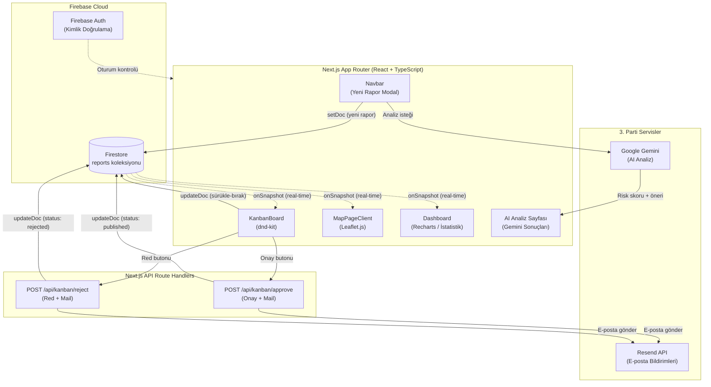

<h1 align="center">
  <br>
  💧 AquaGuard
  <br>
</h1>

<h3 align="center">AI Destekli, Rol Tabanlı Su Kalitesi İzleme ve Çevre Raporlama Platformu</h3>

<p align="center">
  <a href="https://aquaguard-app-vert.vercel.app">
    
  </a>
</p>

<p align="center">
  
  
  
  
  
  
  
  
  
</p>

<p align="center">
  <a href="#-neden-aquaguard">Neden Var</a> ·
  <a href="#-özellikler">Özellikler</a> ·
  <a href="#️-mimari">Mimari</a> ·
  <a href="#-rol-sistemi">Roller</a> ·
  <a href="#-hızlı-başlangıç">Kurulum</a> ·
  <a href="#️-yapılandırma">Yapılandırma</a>
</p>

---

> **v3 · Son Sürüm** — AquaGuard, in-memory ve localStorage bağımlılığından tamamen kurtulmuş; Firebase Firestore tabanlı gerçek zamanlı (`onSnapshot`) bir mimariye geçmiştir.

---

## 💡 Neden AquaGuard?

Türkiye'de su kirliliği ihbarları çoğunlukla **dağınık kanallar**, **gecikmeli bürokratik süreçler** ve **statik PDF raporlar** aracılığıyla yönetilmektedir. Bir vatandaşın bildirdiği kirlilik olayının yetkililere ulaşması, incelenmesi ve kamuoyuyla paylaşılması günlerce sürebilmektedir.

**AquaGuard bu döngüyü kırar:**

| Geleneksel Yöntem | AquaGuard |
|---|---|
| 📋 Kâğıt/e-posta formu | 🖥️ Anlık dijital raporlama |
| ⏳ Günler süren onay süreci | ⚡ Saniyeler içinde canlı haritada görünme |
| 🗺️ Statik, eski tarihli haritalar | 🗺️ Gerçek zamanlı güncellenen interaktif harita |
| 🤷 Manuel risk sınıflandırması | 🤖 Gemini AI otomatik analiz ve risk skoru |
| 📧 Manuel e-posta bildirimleri | 📬 Resend API ile otomatik bildirimler |

---

## ✨ Özellikler

### 🔴 Gerçek Zamanlı Veri Altyapısı
Firebase Firestore `onSnapshot` dinleyicileri sayesinde hiçbir sayfa yenilemesine gerek kalmadan raporlar; **Dashboard**, **Kanban Panosu** ve **Harita** üzerinde eş zamanlı olarak güncellenir.

### 🗺️ Canlı Kirlilik Haritası
Leaflet.js tabanlı interaktif haritada onaylanmış raporlar risk seviyesine göre renk kodlamalı markerlar ile işaretlenir:
- 🔴 **Kritik** risk bölgeleri
- 🟡 **Orta** risk bölgeleri  
- 🟢 **Düşük** risk bölgeleri

### 📊 Sürükle-Bırak Kanban Panosu
`dnd-kit` tabanlı Kanban panosuyla raporlar kolonlar arasında sürüklenerek yönetilir:

```
Beklemede → 1. Onay → Yayınlandı
                ↘ Reddedildi
```

Her hareket Firestore'a anında yansır; başka bir yetkili ekranı otomatik güncellenir.

### 🤖 Google Gemini AI Entegrasyonu
Her yeni rapor gönderildiğinde Gemini yapay zekası devreye girer:
- **Risk seviyesi** tahmini (Düşük / Orta / Kritik)
- **Kirlilik türü** sınıflandırması
- **Önerilen müdahale** adımları

### 📬 Otomatik E-posta Bildirimleri (Resend)
Onay veya red işlemi gerçekleştiğinde:
- Rapor sahibine sonuç bildirimi
- Yöneticilere bilgi e-postası

### 🔒 Rol Tabanlı Erişim Kontrolü
Üç katmanlı yetkilendirme sistemi (bkz. [Rol Sistemi](#-rol-sistemi))

### 🔐 İki Faktörlü Doğrulama (2FA)
Gelişmiş güvenlik için 2FA desteği — ayrıntılar için [`2FA_INTEGRATION.md`](2FA_INTEGRATION.md) dosyasına bakın.

### 📱 Tam Responsive Tasarım
Framer Motion animasyonlarıyla desteklenmiş, tüm ekran boyutlarında kusursuz çalışan modern arayüz.

---

## 🏗️ Mimari

### Klasör Yapısı

```
aquaguard-app/
│
├── app/                          # Next.js App Router
│   ├── ai-analiz/                # AI rapor analizi sayfası
│   ├── arsiv/                    # Arşivlenmiş raporlar
│   ├── ayarlar/                  # Kullanıcı ayarları
│   ├── harita/                   # Canlı kirlilik haritası
│   ├── kanban/                   # Kanban yönetim panosu
│   ├── kullanicilar/             # Kullanıcı yönetimi (Admin)
│   ├── login/                    # Giriş sayfası
│   ├── profil/                   # Kullanıcı profili
│   ├── register/                 # Kayıt sayfası
│   ├── mail-sablonlari/          # E-posta şablonları
│   ├── api/                      # Server-side API Route'ları
│   │   ├── kanban/approve/       # Onay API'si + mail tetikleyici
│   │   └── kanban/reject/        # Red API'si + mail tetikleyici
│   ├── layout.tsx                # Global layout (Sidebar + Navbar)
│   └── globals.css               # Global stiller
│
├── components/                   # Yeniden kullanılabilir bileşenler
│   ├── AiAnalysis/               # AI analiz bileşenleri
│   ├── AppShell/                 # Uygulama çerçevesi
│   ├── AuthProvider/             # Firebase Auth context
│   ├── Dashboard/                # Dashboard widget'ları
│   ├── Kanban/                   # Kanban kartları ve kolonları
│   ├── MailTemplates/            # React e-posta şablonları
│   ├── MapPage/                  # Leaflet harita bileşeni
│   ├── MixpanelProvider/         # Analitik entegrasyonu
│   ├── Navbar/                   # Üst navigasyon
│   ├── ReportModal/              # Yeni rapor modal'ı
│   ├── Sidebar/                  # Sol kenar çubuğu
│   └── ThemeProvider/            # Tema yönetimi
│
├── lib/                          # Yardımcı kütüphaneler
│   ├── firebase.ts               # Firebase başlatma ve config
│   └── gemini.ts                 # Gemini AI istemcisi
│
├── services/
│   └── data-stream/              # Gerçek zamanlı veri akış servisi
│
├── scripts/                      # Yardımcı betikler
├── public/                       # Statik dosyalar
│
├── .env.example                  # Ortam değişkenleri şablonu
├── firestore.rules               # Firestore güvenlik kuralları
├── 2FA_INTEGRATION.md            # 2FA kurulum rehberi
└── EMAIL_SETUP.md                # E-posta kurulum rehberi
```

### Veri Akışı



---

## 👥 Rol Sistemi

AquaGuard üç katmanlı bir yetki mimarisine sahiptir:

| Rol | Sembol | Yetkiler | Erişebileceği Sayfalar |
|-----|--------|----------|----------------------|
| **Vatandaş** | 🧑 | Rapor oluşturma, kendi raporlarını görüntüleme ve takip etme | Dashboard, Harita, Profil |
| **Uzman** | 🔬 | Raporları inceleme, `1. Onay`'a taşıma, teknik yorum ekleme | Dashboard, Harita, Kanban, AI Analiz |
| **Yönetici** | 👑 | Tam erişim: `Yayınlandı`'ya taşıma, rapor silme, kullanıcı yönetimi, sistem ayarları | Tüm sayfalar + Kullanıcılar + Ayarlar |

> **Rol atama:** Kullanıcı rolleri Firebase Firestore'daki `users` koleksiyonundaki `role` alanı üzerinden yönetilir.

---

## 🚀 Hızlı Başlangıç

### Gereksinimler

- **Node.js** v18 veya üzeri
- **npm** v9 veya üzeri
- [Firebase](https://console.firebase.google.com/) projesi (Firestore + Authentication etkin)
- [Resend](https://resend.com/) hesabı ve API anahtarı
- [Google AI Studio](https://aistudio.google.com/) Gemini API anahtarı

### Kurulum Adımları

```bash
# 1. Repoyu klonlayın
git clone https://github.com/meryemgcl/aquaguard-app.git
cd aquaguard-app

# 2. Bağımlılıkları yükleyin
npm install

# 3. Ortam değişkenlerini ayarlayın
cp .env.example .env.local
# .env.local dosyasını kendi değerlerinizle düzenleyin

# 4. Geliştirme sunucusunu başlatın
npm run dev
```

Tarayıcınızda **[http://localhost:3000](http://localhost:3000)** adresini açın.

### Kullanılabilir Script'ler

```bash
npm run dev      # Geliştirme sunucusu (hot-reload ile)
npm run build    # Production build oluştur
npm start        # Production sunucusunu başlat
npm run lint     # ESLint kod kalite kontrolü
```

---

## ⚙️ Yapılandırma

Proje kök dizininde `.env.local` dosyası oluşturun:

```env
# ━━━━━━━━━━━━━━━━━━━━━━━━━━━━━━━━
# Firebase Yapılandırması
# ━━━━━━━━━━━━━━━━━━━━━━━━━━━━━━━━
NEXT_PUBLIC_FIREBASE_API_KEY="your_api_key"
NEXT_PUBLIC_FIREBASE_AUTH_DOMAIN="your_project_id.firebaseapp.com"
NEXT_PUBLIC_FIREBASE_PROJECT_ID="your_project_id"
NEXT_PUBLIC_FIREBASE_STORAGE_BUCKET="your_project_id.firebasestorage.app"
NEXT_PUBLIC_FIREBASE_MESSAGING_SENDER_ID="your_sender_id"
NEXT_PUBLIC_FIREBASE_APP_ID="your_app_id"

# ━━━━━━━━━━━━━━━━━━━━━━━━━━━━━━━━
# E-posta Servisi (Resend)
# ━━━━━━━━━━━━━━━━━━━━━━━━━━━━━━━━
RESEND_API_KEY="re_xxxxxxxxxxxxxxxxxxxx"

# ━━━━━━━━━━━━━━━━━━━━━━━━━━━━━━━━
# Yapay Zeka (Google Gemini)
# ━━━━━━━━━━━━━━━━━━━━━━━━━━━━━━━━
GEMINI_API_KEY="your_gemini_api_key"

# ━━━━━━━━━━━━━━━━━━━━━━━━━━━━━━━━
# Yönetici Bildirim E-postaları
# ━━━━━━━━━━━━━━━━━━━━━━━━━━━━━━━━
ADMIN_EMAIL="admin@yourdomain.com"
YONETICI_EMAIL="yonetici@yourdomain.com"
```

> 💡 Firebase yapılandırma değerlerini [Firebase Console](https://console.firebase.google.com/) → Proje Ayarları → Genel → "Uygulamalarınız" bölümünden alabilirsiniz.

**Ek kurulum rehberleri:**
- 📧 E-posta sistemi kurulumu: [`EMAIL_SETUP.md`](EMAIL_SETUP.md)
- 🔐 İki faktörlü doğrulama: [`2FA_INTEGRATION.md`](2FA_INTEGRATION.md)

---

## 🔄 Rapor İş Akışı

```
  [Vatandaş]
      │ Yeni rapor oluşturur (konum + başlık + açıklama)
      ▼
  Geocoding (koordinata dönüştürme)
  + Gemini AI risk analizi
      │
      ▼
  ┌─────────────┐
  │  Beklemede  │  ◄── Firestore'da, tüm ekranlara anlık yansır
  └──────┬──────┘
         │ Uzman inceler ve onaylar
         ▼
  ┌─────────────┐
  │   1. Onay   │  ◄── Teknik değerlendirme aşaması
  └──────┬──────┘
         │ Yönetici nihai onayı verir         │ veya reddeder
         ▼                                    ▼
  ┌─────────────┐                    ┌──────────────┐
  │ Yayınlandı  │                    │  Reddedildi  │
  │ (Haritada!) │                    │  (Mail ile   │
  └─────────────┘                    │   bildirim)  │
                                     └──────────────┘
```

---

## 🧰 Teknoloji Yığını

| Katman | Teknoloji | Açıklama |
|--------|-----------|----------|
| **Framework** | Next.js 15 (App Router) | Sunucu bileşenleri + Route Handlers |
| **Dil** | TypeScript 5 | Tip güvenli geliştirme |
| **Veritabanı** | Firebase Firestore | Gerçek zamanlı NoSQL veritabanı |
| **Kimlik Doğrulama** | Firebase Auth + bcryptjs + JWT | Güvenli oturum yönetimi + 2FA |
| **Yapay Zeka** | Google Gemini API | Risk analizi ve öneriler |
| **Harita** | Leaflet.js | İnteraktif kirlilik haritası |
| **Kanban** | dnd-kit | Sürükle-bırak rapor yönetimi |
| **Animasyon** | Framer Motion 13 | Akıcı UI geçişleri |
| **E-posta** | Resend | İşlemsel e-posta bildirimleri |
| **Deployment** | Vercel | Otomatik CI/CD deploy |
| **Analitik** | Mixpanel | Kullanıcı davranış analizi |

---

## 🤝 Katkıda Bulunma

Projeye katkıda bulunmak isterseniz:

1. Bu repoyu **fork**'layın
2. Yeni bir branch oluşturun:
   ```bash
   git checkout -b feature/yeni-ozellik
   ```
3. Değişikliklerinizi commit'leyin ([Conventional Commits](https://www.conventionalcommits.org/) standardını kullanın):
   ```bash
   git commit -m "feat: yeni özellik açıklaması"
   ```
4. Branch'inizi push'layın:
   ```bash
   git push origin feature/yeni-ozellik
   ```
5. **Pull Request** açın

### Commit Mesajı Standartları

| Prefix | Kullanım |
|--------|----------|
| `feat:` | Yeni özellik |
| `fix:` | Hata düzeltmesi |
| `docs:` | Dokümantasyon güncellemesi |
| `refactor:` | Kod yeniden yapılandırma |
| `style:` | Kod formatı (işlevsellik değişmeden) |
| `test:` | Test ekleme/güncelleme |
| `chore:` | Build/config değişiklikleri |

---

## 📄 Lisans

Bu proje **MIT Lisansı** altında lisanslanmıştır — ayrıntılar için [`LICENSE`](LICENSE) dosyasına bakın.

---

<p align="center">
  <strong>Geliştirici:</strong> <a href="https://github.com/meryemgcl">Meryem Güçlü</a>
  <br><br>
  <em>"Temiz su, temiz gelecek."</em>
  <br><br>
  Bu projeyi beğendiyseniz ⭐ vermeyi unutmayın!
</p>
